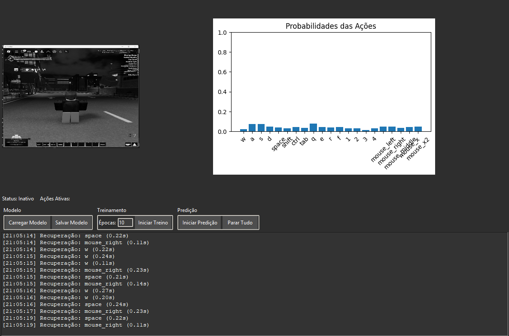
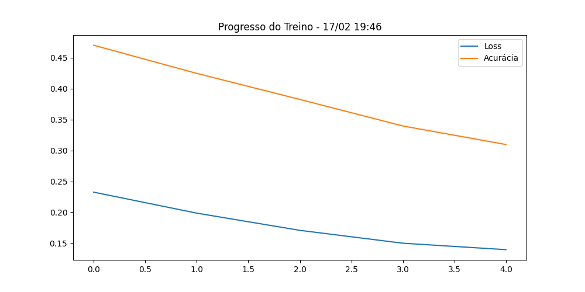

Roblox AI Trainer
==================

# 🤖 Roblox AI Controller 🎮

[](https://www.python.org/downloads/)
[](https://www.tensorflow.org/install)
[](https://pypi.org/project/opencv-python/)
[](https://pypi.org/project/PyAutoGUI/)
[](https://pypi.org/project/pywin32/)
[](https://pypi.org/project/keyboard/)
[](https://pypi.org/project/mouse/)
[](https://pypi.org/project/matplotlib/)
[](https://github.com/seuusuario/roblox-ai-controller)

**Uma IA "avançada" para controle automático de personagens no Roblox com aprendizado profundo e recuperação de colisões**



## 📑 Descrição

Este projeto é um controlador AI inteligente para Roblox que utiliza redes neurais convolucionais (CNN) para aprender e replicar comportamentos de jogo. Com recursos como detecção de colisões, sistema de recuperação automática e interface visual intuitiva, ele permite:

- 🧠 Treinamento do modelo em tempo real
- 🕹️ Controle automático do personagem
- 🚨 Sistema anti-travamento
- 📊 Monitoramento em tempo real das ações
- 🖥️ Visualização dupla da tela e previsões

## ✨ Funcionalidades Principais

- **Detecção Inteligente de Colisões**
  - Sistema de recuperação com sequência personalizável
  - Escape automático de loops de colisão
- **Modos de Operação**
  - 🏋️ Modo Treino (coleta dados e treina o modelo)
  - 🤖 Modo Predict (controle automático do jogo)
- **Interface Amigável**
  - Tema escuro moderno
  - Visualização em tempo real do jogo
  - Gráfico interativo de previsões
- **Controles Avançados**
  - 🚨 Parada de emergência (Ctrl+Shift+L)
  - Suporte a múltiplos dispositivos de entrada
  - Smoothing de movimentos do mouse
- **Gestão de Modelos**
  - Carregar/Salvar modelos treinados
  - Monitoramento do treino com gráficos
  - Auto-salvamento periódico

## Exemplo de plotagem de previsões 📊📈



## 📋 Pré-requisitos

- Python 3.8 ou superior
- Janela do Roblox em execução (com título "Roblox")
- Resolução mínima de tela: 1280x720
- Espaço em disco: ~5GB (para modelos e datasets)

As dependências podem ser instaladas com:

```bash
pip install tensorflow opencv-python numpy pyautogui pywin32 keyboard mouse matplotlib
```

## Configuração do Ambiente ⚙️💻🔧

O projeto faz algumas configurações iniciais para garantir um melhor desempenho:

- Suprime mensagens desnecessárias do TensorFlow.
- Configura a GPU para utilizar alocação dinâmica de memória.
- Define limites de *threads* para processamento paralelo.

## Estrutura do Projeto 📂📌📋

- **`RobloxAITrainer`**: Classe principal que gerencia a captura de tela, treinamento e inferência.
- **`init_model`**: Inicializa a rede neural convolucional e carrega pesos de um modelo salvo.
- **`setup_gui`**: Configura a interface gráfica para controle do treinamento.
- **`capture_screen`**: Captura a tela da janela do Roblox e processa a imagem.
- **`get_current_actions`**: Obtém o estado atual das teclas e do mouse.
- **`training_worker`**: Gerencia o processo de treinamento da IA.
- **`capture_and_preview_loop`**: Exibe visualmente a captura de tela e acumula dados para treinamento.

## Treinamento 🏋️📈🧠

O modelo recebe capturas de tela da janela do Roblox e as associa às ações do jogador (teclas pressionadas e movimentação do mouse). O treinamento é realizado em *batches* e os resultados são armazenados para análise.

Para iniciar o treinamento, execute o script principal e utilize a interface para configurar os *epochs* e iniciar a captura de dados.

## Inferência (Predição) 🔍🎯🤔

Após o treinamento, o modelo pode ser utilizado para prever as próximas ações do jogador, baseado na imagem da tela.

## Salvamento do Modelo 💾📂🔄

O modelo treinado é salvo automaticamente no diretório `models/` e pode ser recarregado para uso futuro.

## Encerramento e Limpeza 🛑🚮✅

- O programa registra um *hook* para limpar os recursos ao sair.
- Todas as janelas *OpenCV* abertas são fechadas ao encerrar.
- Os arquivos de log de treinamento são salvos automaticamente para revisão posterior.

## Controles Rápidos ⌨️🎮🖱️

- Pressionar `ctrl+shift+l` interrompe todas as atividades e fecha o programa.
- O botão "Stop" na interface também interrompe o treinamento ou a predição.
